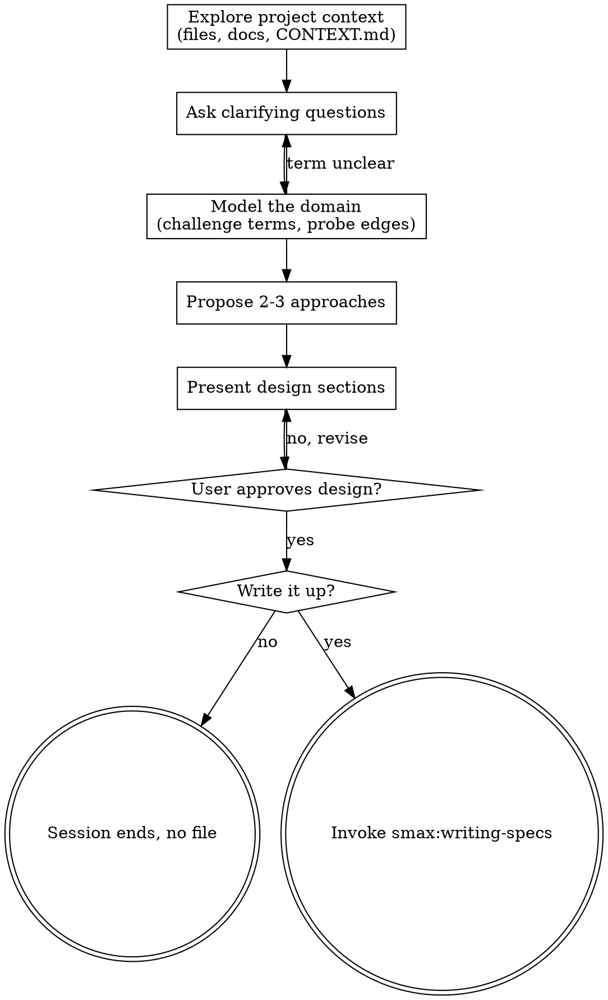

# Brainstorming Ideas Into Designs

Help turn ideas into fully formed designs through natural collaborative dialogue.

Start by understanding the current project context, then ask questions one at a time to refine the idea. Once you understand what you're building, present the design and get user approval.

<HARD-GATE>
Do NOT invoke any implementation skill, write any code, scaffold any project, or take any implementation action until you have presented a design and the user has approved it. This applies to EVERY project regardless of perceived simplicity.
</HARD-GATE>

## Anti-Pattern: "This Is Too Simple To Need A Design"

Every project goes through this process. A todo list, a single-function utility, a config change — all of them. "Simple" projects are where unexamined assumptions cause the most wasted work. The design can be short (a few sentences for truly simple projects), but you MUST present it and get approval.

## Checklist

You MUST create a task for each of these items and complete them in order:

1. **Explore project context** — check files, docs, recent commits, the project's glossary (`CONTEXT.md`, or the contexts named in `CONTEXT-MAP.md`), and **the titles of the recorded Decisions** (see below). **Never read anything under `Archive/` as current project context** — archived specs and plans record what *was* decided, not what holds now, and mistaking one for current is the most expensive error available at this step.
2. **Offer the visual companion just-in-time** — NOT upfront. The first time a question would genuinely be clearer shown than described, offer it then (its own message); on approval its browser tab opens for you. If no visual question ever arises, never offer it. See the Visual Companion section below.
3. **Ask clarifying questions** — one at a time, understand purpose/constraints/success criteria
4. **Model the domain while you ask** — challenge terms, sharpen fuzzy language, drive scenarios into the edges, cross-check against the code, **and write each settled term down as it settles**. Runs alongside step 3, not after it. See below.
5. **Propose 2-3 approaches** — with trade-offs and your recommendation
6. **Present design** — in sections scaled to their complexity, get user approval after each section
7. **Ask whether this should become a document** — see "Closing the session"

## Process Flow



**The only successor skill is `smax:writing-specs`, and the path there is optional.** Do NOT invoke `frontend-design`, an MCP builder, or any other implementation skill from here. `smax:domain-modeling` may run alongside this session — it is a companion, not a successor.

## The Process

**Reading the recorded Decisions:**

`docs/decisions/` holds the choices this project already made and does not want re-litigated. **The filename is the index** — that is what the `NNNN-descriptive-slug.md` scheme is for. So:

```bash
ls docs/decisions/ 2>/dev/null    # cheap, bounded, tells you what exists
```

Judge by title. **Open only the ones that touch what you are about to design** — zero to two, typically. Reading all of them defeats the point; a project with forty Decisions would cost more context than the design conversation itself.

Then use them two ways:

- **As a constraint.** If your design would contradict a recorded Decision, say so *before* proposing it: *"`0003-manuelles-sql-statt-orm` rules this out — it was a deliberate choice. Do you want to overturn it, or should I design within it?"* A Decision exists precisely because the obvious path looks better than it is.
- **As a starting point.** A Decision that already answers a question saves you asking it. Say which one and move on.

**Never silently reverse a Decision.** Overturning one is a legitimate outcome of a design session — doing it without naming it is not. If the user does overturn it, the old Decision gets a `superseded by Decision-NNNN` status via `smax:domain-modeling`; it is never deleted.

If `docs/decisions/` does not exist, skip this silently. Do not suggest creating it — it comes into being when the first Decision is made, not before.

**Understanding the idea:**

- Check out the current project state first (files, docs, recent commits)
- Before asking detailed questions, assess scope: if the request describes multiple independent subsystems (e.g., "build a platform with chat, file storage, billing, and analytics"), flag this immediately. Don't spend questions refining details of a project that needs to be decomposed first.
- If the project is too large for a single spec, help the user decompose into sub-projects: what are the independent pieces, how do they relate, what order should they be built? Then brainstorm the first sub-project through the normal design flow. Each sub-project gets its own spec → plan → implementation cycle.
- For appropriately-scoped projects, ask questions one at a time to refine the idea
- Prefer multiple choice questions when possible, but open-ended is fine too
- Only one question per message - if a topic needs more exploration, break it into multiple questions
- Focus on understanding: purpose, constraints, success criteria

**Modelling the domain while you ask:**

This runs *during* the questions, not after them — vocabulary that stays fuzzy through the design phase gets baked into the code.

- **Challenge terms against the glossary.** If the user uses a term in a sense that conflicts with `CONTEXT.md`, say so at once: *"Your glossary defines 'cancellation' as X, but you seem to mean Y — which is it?"*
- **Sharpen fuzzy language.** Propose a precise canonical term for vague or overloaded ones: *"You're saying 'account' — Customer or User? Those are different things."*
- **Drive scenarios into the edges.** Invent concrete cases that force precision about the boundaries between concepts.
- **Cross-check against the code.** When the user states how something works, verify the code agrees. Surface contradictions.

<HARD-GATE>
**The moment a term is settled, it goes into `CONTEXT.md` — via `smax:domain-modeling`, in that same turn.** Not at the end of the session, not "later when a second document needs it", not as a table inside the spec. This is not conditional on the amount of modelling work: **one** settled term is enough to trigger it.

Same for decisions. A design choice that is hard to reverse, surprising without context, and the result of a real trade-off becomes a file under `docs/decisions/` **when you make it** — not a section in a document you have not written yet.
</HARD-GATE>

`smax:domain-modeling` owns the file formats, the lazy-creation rules and the `CLAUDE.md` wiring. Invoke it; do not reimplement it here.

**Why this is a gate and not a suggestion.** A glossary that lives inside a spec is invisible to everything downstream: the code reviewer's naming check reads `CONTEXT.md`, the terminology line in the plan's `Global Constraints` points at `CONTEXT.md`, the SDD implementer dispatch pastes from `CONTEXT.md`, and the `CLAUDE.md` import loads `CONTEXT.md`. Four mechanisms read that one file. Writing the terms anywhere else leaves all four holding nothing.

| Rationalization | Reality |
|---|---|
| "I'll move the terms to `CONTEXT.md` later, once a second document needs them" | There is no later. The spec gets written, the session ends, and four downstream mechanisms read an empty glossary. Write it now. |
| "A terminology table in the spec covers it" | The spec is not on any tool's read path. `CONTEXT.md` is. |
| "Only two or three terms came up — not worth a file" | One term is worth the file. The file is three lines long. |
| "These are design decisions, they belong in the spec" | Decisions that meet all three criteria belong in `docs/decisions/`, and the spec references them. A spec with six inline `### E<n>` sections is six missing Decision files. |

**Exploring approaches:**

- Propose 2-3 different approaches with trade-offs
- Present options conversationally with your recommendation and reasoning
- Lead with your recommended option and explain why
- YAGNI ruthlessly - remove unnecessary features from every approach and design

**Presenting the design:**

- Once you believe you understand what you're building, present the design
- Scale each section to its complexity: a few sentences if straightforward, up to 200-300 words if nuanced
- Ask after each section whether it looks right so far
- Cover: architecture, components, data flow, error handling, testing
- Be ready to go back and clarify if something doesn't make sense

**Design for isolation and clarity:**

- Break the system into smaller units that each have one clear purpose, communicate through well-defined interfaces, and can be understood and tested independently
- For each unit, you should be able to answer: what does it do, how do you use it, and what does it depend on?
- Can someone understand what a unit does without reading its internals? Can you change the internals without breaking consumers? If not, the boundaries need work.
- Smaller, well-bounded units are also easier for you to work with - you reason better about code you can hold in context at once, and your edits are more reliable when files are focused. When a file grows large, that's often a signal that it's doing too much.

**Working in existing codebases:**

- Explore the current structure before proposing changes. Follow existing patterns.
- Where existing code has problems that affect the work (e.g., a file that's grown too large, unclear boundaries, tangled responsibilities), include targeted improvements as part of the design - the way a good developer improves code they're working in.
- Don't propose unrelated refactoring. Stay focused on what serves the current goal.

## Closing the session

Once the design is approved, **name the document type in the question.** Decide it yourself first — the criterion is one line:

| The session produced | Type |
|---|---|
| a design for something that is to be built | **SPEC** |
| an assessment or investigation of something that already exists, with no decision to build | **ANALYSIS** |

Then ask, with the type filled in:

> "Should I write this up as a **SPEC** document, or is thinking it through enough for now?"

**Only ask which type when the session genuinely produced both** — an assessment *and* a decision to build. Then say so and let the user pick, or point out that it is two documents:

> "This went two ways: an assessment of how the current export behaves, and a design for the replacement. SPEC, ANALYSIS, or both as separate documents?"

Do not ask which type as a reflex. A design session produces a SPEC; say so.

**"No" is a valid outcome, not an abort.** The session ends there with no file. State what was decided in a sentence or two and stop. Anything `smax:domain-modeling` wrote during the session stays — those are facts about the domain, not artifacts of a document that was never written.

**"Yes" → invoke `smax:writing-specs`, passing the type you named.** It owns the path, the filename, the reviewer dispatch, the user gate and the handoff to planning. Do not write the document yourself.

## Visual Companion

A browser-based companion for showing mockups, diagrams, and visual options during brainstorming. Available as a tool — not a mode. Accepting the companion means it's available for questions that benefit from visual treatment; it does NOT mean every question goes through the browser.

**Offering the companion (just-in-time):** Do NOT offer it upfront. Wait until a question would genuinely be clearer shown than told — a real mockup / layout / diagram question, not merely a UI *topic*. The first time that happens, offer it then, as its own message:
> "This next part might be easier if I show you — I can put together mockups, diagrams, and comparisons in a browser tab as we go. It's still new and can be token-intensive. Want me to? I'll open it for you."

**This offer MUST be its own message.** Only the offer — no clarifying question, summary, or other content. Wait for the user's response. If they accept, start the server with `--open` so their browser opens to the first screen automatically. If they decline, continue text-only and don't offer again unless they raise it.

**Per-question decision:** Even after the user accepts, decide FOR EACH QUESTION whether to use the browser or the terminal. The test: **would the user understand this better by seeing it than reading it?**

- **Use the browser** for content that IS visual — mockups, wireframes, layout comparisons, architecture diagrams, side-by-side visual designs
- **Use the terminal** for content that is text — requirements questions, conceptual choices, tradeoff lists, A/B/C/D text options, scope decisions

A question about a UI topic is not automatically a visual question. "What does personality mean in this context?" is a conceptual question — use the terminal. "Which wizard layout works better?" is a visual question — use the browser.

If they agree to the companion, read the detailed guide before proceeding:
[visual-companion.md](visual-companion.md)
