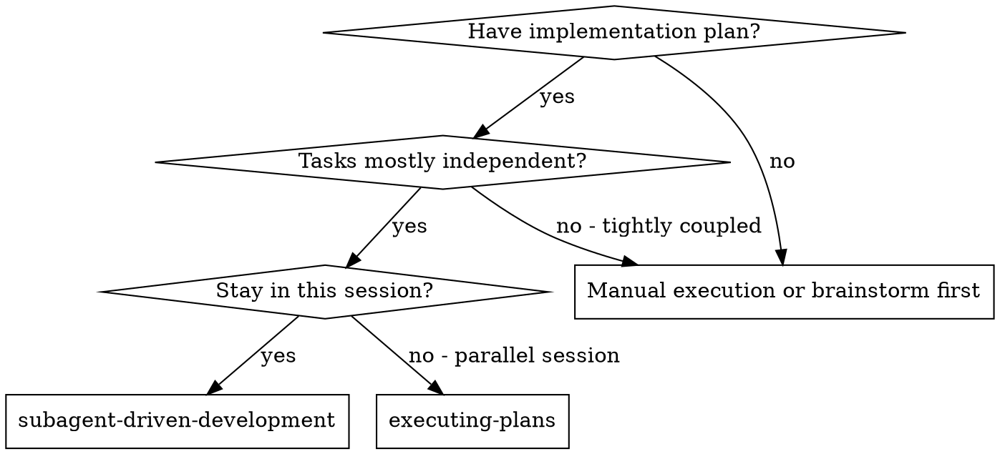

# Subagent-Driven Development

Execute plan by dispatching a fresh implementer subagent per task, a task review (spec compliance + code quality) after each, and a broad whole-branch review at the end.

**Why subagents:** You delegate tasks to specialized agents with isolated context. By precisely crafting their instructions and context, you ensure they stay focused and succeed at their task. They should never inherit your session's context or history — you construct exactly what they need. This also preserves your own context for coordination work.

**Core principle:** Fresh subagent per task + task review (spec + quality) + broad final review = high quality, fast iteration

**Narration:** between tool calls, narrate at most one short line — the
ledger and the tool results carry the record.

**Continuous execution:** Do not pause to check in with your human partner between tasks. Execute all tasks from the plan without stopping. The only reasons to stop are: BLOCKED status you cannot resolve, ambiguity that genuinely prevents progress, or all tasks complete. "Should I continue?" prompts and progress summaries waste their time — they asked you to execute the plan, so execute it.

## When to Use



**vs. Executing Plans (parallel session):**
- Same session (no context switch)
- Fresh subagent per task (no context pollution)
- Per task: the implementer's self-review plus your check of its report. One fresh-eyes review at the end, over the whole branch
- A task reviewer subagent only where the implementer reports doubt about correctness or scope
- Faster iteration (no human-in-loop between tasks)

## The Process

Setup (worktree, ledger, read plan, pre-flight scan), then per task:

1. Dispatch the implementer ([implementer-prompt.md](implementer-prompt.md)). Answer its questions before it starts.
2. It implements, tests, commits, self-reviews, writes its report to a file.
3. **You read the report** against the brief: coverage, Global Constraints, test evidence, `git diff --stat`. On `DONE_WITH_CONCERNS` about correctness or scope, and only then, dispatch a task reviewer.
4. Any finding → fix loop, max 5 rounds (rounds 1–3 resume the implementer, 4–5 a fresh one on a stronger model). You verify each fix report yourself. A finding that conflicts with the plan's text goes to your human partner first.
5. At round 5 the breaker trips: adjudicate each open finding — park it with a ruling, or STOP as BLOCKED if it is load-bearing.
6. Append the completion line to the ledger, mark the todo, next task.

After the last task: final whole-branch review (most capable model, [code-reviewer.md](../code-review/code-reviewer.md)), ONE fix dispatch, one scoped re-review, adjudicate residuals, append `Final review: clean (HEAD <sha7>)`, keep the workspace, hand to `smax:finishing-a-development-branch`.

Each step is specified below — this list is the map, not the instructions.

## Setup

Ensure the work happens in an isolated workspace: use
smax:using-git-worktrees to create one or verify the existing one.
Never start implementation on a main/master branch without your human
partner's explicit consent.

**This skill is normally entered cold** — the plan was written yesterday, in a
session that has ended. Two inputs are then not given to you, and neither may
be guessed:

- **Which plan file.** `docs/02_Plans/` can hold several topics, and a topic
  several dated plans. List it, pick the one meant, and name your pick before
  dispatching anything. Never take a file under `Archive/` as a current plan.
- **Which commit the branch forked from.** The final review's range depends on
  it. `git merge-base main HEAD` is a guess whenever the branch came off
  something other than `main`, and a wrong base silently widens the review to
  unrelated commits — spending your most capable model on them and diluting
  the one fresh-eyes pass the branch gets. If neither the plan, the branch's
  upstream, nor the conversation names the base branch, ask.

Conversation memory does not survive compaction. In real sessions,
controllers that lost their place have re-dispatched entire completed task
sequences — the single most expensive failure observed. Track progress in
a ledger file, not only in todos.

**After a compaction, re-read this `SKILL.md` before deciding the next step.**
The ledger tells you *where* you are; the procedure exists only here, and your
summary of it is not a reliable copy. Unlike `CLAUDE.md`, a skill body is not
re-injected from disk — it is summarised along with everything else, so the
branch you need (which concerns get a reviewer, when the breaker means BLOCKED
rather than parked) may simply no longer be in front of you.

- Each plan owns a workspace: at skill start, run this skill's
  `scripts/sdd-workspace PLAN_FILE` — it prints the plan's git-ignored
  directory (`<repo-root>/.smax/sdd/<plan-basename>/`), home to
  every artifact for THIS plan: ledger, briefs, reports, review packages.
  Another plan's directory is never yours to read or write.
- Check for this plan's ledger at `<workspace>/progress.md`. If its first
  line names your plan file, tasks with a `Task <N>: complete` line are DONE
  — do not re-dispatch them; resume at the first task without one. A task
  whose last line is a fix round is mid-loop: resume the loop at the next
  round. A ledger whose first line names a different plan file — or a stray
  ledger sitting flat at `.smax/sdd/progress.md` instead of inside a plan
  directory — is not yours: leave it in place and start your own, fresh.
- Create the ledger with its identity as the first line:
  `# SDD ledger — plan: <plan file path>`.
- The ledger is your recovery map: the commits it names exist in git even
  when your context no longer remembers creating them. After compaction,
  trust the ledger and `git log` over your own recollection.
- `git clean -fdx` will destroy the workspace (it's git-ignored scratch); if
  that happens, recover from `git log`.

Read the plan once, note its context and Global Constraints, and create a
todo per task.

**Task commits run without asking.** They live on a feature branch that gets
squashed away and deleted, they are the review range and the ledger's recovery
map, and nothing outside the branch ever sees them. Asking per task would put a
prompt between every pair of tasks and remove the reason to use this skill at
all.

**What does get asked lives in `smax:finishing-a-development-branch`**: the
squash commit onto the base branch, the branch deletion, any push, the PR. That
is where this work becomes visible outside the branch, and that skill asks for
each one separately. Do not pre-authorise any of it from here.

Before dispatching Task 1, scan the plan once for conflicts:

- tasks that contradict each other or the plan's Global Constraints
- anything the plan explicitly mandates that the review rubric treats as a
  defect (a test that asserts nothing, verbatim duplication of a logic block)

Present everything you find to your human partner as one batched question —
each finding beside the plan text that mandates it, asking which governs —
before execution begins, not one interrupt per discovery mid-plan. If the
scan is clean, proceed without comment. The review loop remains the net for
conflicts that only emerge from implementation.

## Model Selection

Use the least powerful model that can handle each role to conserve cost and increase speed.

**Mechanical implementation tasks** (isolated functions, clear specs, 1-2 files): use a fast, cheap model. Most implementation tasks are mechanical when the plan is well-specified.

**Integration and judgment tasks** (multi-file coordination, pattern matching, debugging): use a standard model.

**Architecture and design tasks**: use the most capable available model.
The final whole-branch review is one of these — dispatch it on the most
capable available model, not the session default.

**Review tasks**: choose the model with the same judgment, scaled to the
diff's size, complexity, and risk. A small mechanical diff does not need the
most capable model; a subtle concurrency change does. Scoped re-reviews of
small fix diffs take a cheap-to-mid tier.

**Fix-loop escalation (rounds 4-5)**: use a model at least one tier above
the implementer that got stuck.

**Always specify the model explicitly when dispatching a subagent.** An
omitted model inherits your session's model — often the most capable and
most expensive — which silently defeats this section.

**Turn count beats token price.** Wall-clock and context cost scale with how
many turns a subagent takes, and the cheapest models routinely take 2-3× the
turns on multi-step work — costing more overall. Use a mid-tier model as the
floor for reviewers and for implementers working from prose descriptions.
When the task's plan text contains the complete code to write, the
implementation is transcription plus testing: use the cheapest tier for
that implementer. Single-file mechanical fixes also take the cheapest tier.

## The Task Loop

Everything you paste into a dispatch prompt — and everything a subagent
prints back — stays resident in your context for the rest of the session
and is re-read on every later turn. Hand artifacts over as files.

**Two kinds of dispatch, and they differ deliberately:**

| | Named / addressable | Why |
|---|---|---|
| **Implementers** | **yes** — record the agent identity | Fix rounds 1–3 resume this exact agent; its context holds the task and its own choices |
| **Reviewers** (task reviewer, re-review, final review) | **no — one-shot, unnamed** | The report is the agent's final message. A named reviewer becomes a long-lived teammate that finishes, goes idle **without sending its report**, and must be polled |

**Every review is a fresh dispatch.** A reviewer that already reported answers
from its stale snapshot: it cites lines that no longer exist and re-sends its
original findings — a verification that verifies nothing while looking like it
did. Re-reviews get a new agent and a new diff file.

**A trailing idle notification needs no reply.** A named agent sends an
`idle_notification` when it finishes, *after* its report already reached you.
That is bookkeeping, not a request. Do not spend a turn acknowledging it — one
observed run burned four turns on "no action needed" for four such
notifications. Act on reports; ignore idle notices for agents whose report you
already hold.

### 1. Dispatch the implementer

Record BASE (`git rev-parse HEAD`) before dispatching — the review package
and fix-round diffs need it.

- **Task brief:** before dispatching an implementer, run this skill's
  `scripts/task-brief PLAN_FILE N` — it extracts the task's full text to a
  uniquely named file and prints the path. Compose the dispatch so the
  brief stays the single source of
  requirements. Your dispatch should contain: (1) one line on where this
  task fits in the project; (2) the brief path, introduced as "read this
  first — it is your requirements, with the exact values to use verbatim";
  (3) interfaces and decisions from earlier tasks that the brief cannot
  know; (4) your resolution of any ambiguity you noticed in the brief;
  (5) the report-file path and report contract; (6) the entries from
  `CONTEXT.md` that this task touches, pasted verbatim — the relevant ones
  only, never the whole glossary, and omitted entirely when the project has
  none. Exact values (numbers, magic strings, signatures, test cases)
  appear only in the brief. Never make a subagent read the whole plan file.
- **Report file:** name the implementer's report file after the brief
  (brief `…/task-N-brief.md` → report `…/task-N-report.md`) and put it in
  the dispatch prompt. The implementer writes the full report there and
  returns only status, commits, a one-line test summary, and concerns.
- A dispatch prompt describes one task, not the session's history. Do not
  paste accumulated prior-task summaries ("state after Tasks 1-3") into
  later dispatches — a real session's dispatch hit 42k chars of which 99%
  was pasted history. A fresh subagent needs its task, the interfaces it
  touches, and the global constraints. Nothing else.
- If an earlier task parked a finding in the area this task touches, carry
  a pointer to that ledger entry in the dispatch.
- Record the implementer's agent identity from the dispatch result —
  fix-loop rounds 1-3 resume this agent.
- Never dispatch multiple implementation subagents in parallel (conflicts).

Template: [implementer-prompt.md](implementer-prompt.md)

### 2. Handle the report

Implementer subagents report one of four statuses. Handle each appropriately:

**DONE:** Go to step 3 and check the report yourself. No task-reviewer subagent.

**DONE_WITH_CONCERNS:** The implementer completed the work but flagged doubts. **A self-review that ends in doubt is a self-review that did not pass.** Read the concerns:

- **Correctness or scope** — this is the one per-task case that gets a real reviewer. Generate the review package (`scripts/review-package PLAN_FILE BASE HEAD`, from this skill's directory — it prints the file path it wrote; BASE is the commit you recorded before dispatching, never `HEAD~1`, which silently drops all but the last commit of a multi-commit task) and dispatch the task reviewer with [task-reviewer-prompt.md](task-reviewer-prompt.md). The implementer has told you it cannot vouch for its own work; that is exactly the case worth a fresh pair of eyes, and it costs one dispatch instead of one per task.
- **Observations** (e.g. "this file is getting large") — note them in the ledger as deferred minors and continue with step 3.

**NEEDS_CONTEXT:** The implementer needs information that wasn't provided. Provide the missing context and re-dispatch.

**BLOCKED:** The implementer cannot complete the task. Assess the blocker:
1. If it's a context problem, provide more context and re-dispatch with the same model
2. If the task requires more reasoning, re-dispatch with a more capable model
3. If the task is too large, break it into smaller pieces
4. If the plan itself is wrong, escalate to the human

**Never** ignore an escalation or force the same model to retry without changes. If the implementer said it's stuck, something needs to change.

If the implementer asks questions — before starting or mid-task — answer
clearly and completely, provide additional context if needed, and don't
rush it into implementation.

### 3. Check the report yourself

**There is no task-reviewer subagent per task.** The implementer's own self-review plus your check of its report is the per-task gate; the fresh-eyes review happens once, over the whole branch, at the end.

**Read the report file.** Not just the returned status line — the file. You are now the only reader it has, and an unread report is the same as no report. It is 50–100 lines, not a diff; that is affordable once per task and is the whole reason the implementer writes it to a file instead of into your context.

Check four things, in this order:

1. **Brief coverage.** Open the task brief next to the report. Is every step accounted for? A step silently dropped is the single most common failure, and it is visible by comparing two short files.
2. **Global Constraints.** Do the reported names, values and formats match the plan's `Global Constraints` — terminology from `CONTEXT.md`, the Decisions bound there, exact values? This block is the one thing that used to reach every task reviewer; now it reaches only you, so it is on you to apply it.
3. **Test evidence.** The report must carry the command run and its output, and the TDD RED/GREEN evidence when the task required TDD. **A report claiming "tests pass" without the output is not evidence** — send it back rather than believing it. Do not re-run the suite yourself; demand the evidence.
4. **The diff, selectively.** Do not read the whole diff — that is the context cost this design exists to avoid. But `git diff --stat BASE..HEAD` is two lines and catches what a report will never volunteer: files touched that the brief never mentioned, a suspiciously small change for a large task, a test file that did not grow.

**If any of the four fails, that is a finding** — yours, not a reviewer's. It enters the fix loop exactly as a reviewer finding would.

**Requirements you cannot verify from a report** — behaviour living in unchanged code, or spanning tasks — are yours to resolve before marking the task complete. You hold the plan and the cross-task context. Confirm it or note it; do not let it pass unexamined because no reviewer raised it.

**What you give up, stated plainly.** Upstream reviewed every task with a fresh subagent so a defect in Task 3 could not be built upon by Tasks 4–13. Without that, a bad Task 3 surfaces at the final review, when fixing it means touching everything downstream. That is the trade: 13 fewer dispatches against later, more expensive discovery. Two things follow from it and are not optional:

- **Do not wave a task through.** Your check is now the only per-task gate there is. Skipping it does not save a review — it removes the last one.
- **`DONE_WITH_CONCERNS` on correctness or scope gets a real reviewer** (step 2). That is the cheap catch for exactly the tasks most likely to be the bad Task 3.

The task reviewer's template stays available for that case, and for any task you or your human partner judge risky enough to warrant it: [task-reviewer-prompt.md](task-reviewer-prompt.md). Dispatching it is a deliberate exception, not the default.

### 4. The fix loop

The loop triggers on any finding from your step-3 check — a missed brief step,
a violated constraint, missing test evidence, a diff that contradicts the
report — or on any Critical/Important finding from a task reviewer, in the
`DONE_WITH_CONCERNS` case where one was dispatched.

Before the loop starts, two routes leave it immediately:

- Record Minor findings in the progress ledger as you go
  (`Task <N>: minor (deferred): <one-liner>`), and point the final
  whole-branch review at that list so it can triage which must be fixed
  before merge. A roll-up nobody reads is a silent discard. Minor findings
  never enter the loop.
- A finding labeled plan-mandated — or any finding that conflicts with
  what the plan's text requires — is the human's decision, like any plan
  contradiction: present the finding and the plan text, ask which governs.
  Do not dismiss the finding because the plan mandates it, and do not
  dispatch a fix that contradicts the plan without asking.
Everything else enters the loop. A fix round is one fix dispatch plus your
own verification of the fix report. Five rounds maximum per task:

**Rounds 1-3 — resume the original implementer.** Send it the open findings
verbatim. Its context is intact: it knows the task, the code, and its own
choices. If your harness cannot send another message to a live subagent,
dispatch a fresh implementer carrying the brief path, the report-file path,
and the findings — the report file is the persistent memory either way.

**Rounds 4-5 — dispatch a fresh implementer on a more capable model** (per
Model Selection), with the brief path, the report-file path, the open
findings, and this framing: "A prior implementer attempted this task
[N] times; you own it now. Read the report file for what was tried." A loop
that survives three resumes usually means the implementer cannot see its
own problem — fresh eyes and a capability bump in one move.

**Every round, either way:** the implementer fixes, re-runs the tests
covering the amended code, appends its fix report to the same report file,
and returns the short contract. Name the covering test files in the fix
message — a one-line fix does not need the whole suite.

**You verify the fix yourself.** Read the appended fix report and confirm it
contains the covering tests, the command run, and the output. Then verdict each
open finding ADDRESSED or NOT ADDRESSED. `git diff --stat FIX_BASE..HEAD`, where
`FIX_BASE` is the head you checked in the previous round, tells you in two lines
whether the fix touched only what it should have — a fix that sprawls into
unrelated files is itself a finding.

A finding you cannot verdict from the fix report is NOT ADDRESSED. Asking for
evidence costs one message; assuming costs a defect that reaches the final
review with a `complete` line vouching for it.

**Out-of-scope observations go to the ledger as deferred minors** — they never
extend the loop. Only the open findings from this task decide whether another
round runs.

Where a task reviewer was dispatched under `DONE_WITH_CONCERNS`, its scoped
re-review still applies: `scripts/review-package PLAN_FILE FIX_BASE HEAD` plus
[re-review-prompt.md](re-review-prompt.md). That path is the exception, not the
per-round default.

**After each round,** append to the ledger:
`Task <N>: fix round <R>/5 (<X> addressed, <Y> open — <finding one-liners>; commits <a7>..<b7>)`

Never fix findings yourself in the controller session — your context stays
clean for coordination, and controller fixes skip review.

**The breaker.** When round 5's re-review still leaves findings open, stop
dispatching. Adjudicate each open finding yourself — you hold the plan and
the cross-task context the reviewer lacks:

- **The finding is contestable** — or, where a reviewer produced it, the
  reviewer is wrong: park it —
  `Task <N>: parked — <finding> — ruling: <why the code stands>`. The final
  review sees both sides.
- **Real, but nothing downstream builds on it:** park it the same way, with
  a ruling that says it's real and deferred.
- **Real and load-bearing** — a later task builds on it, or it reveals a
  plan defect: STOP. Append `Task <N>: BLOCKED — <reason>` and report to
  your human partner with the finding, the plan text it collides with, and
  the fix history. Parking a structural failure lets every dependent task
  build on it and hands the final review a problem it cannot fix either.

Adjudicate only at the cap. Adjudicating earlier to end a loop is
pre-judging with a different name. Every adjudication is a ledger entry —
a silent discard is forbidden.

### 5. Complete the task

When your check comes back clean — or every open finding is parked with a
ruling at the cap — append the completion line to the ledger in the same
message as your other bookkeeping:

- `Task <N>: complete (commits <base7>..<head7>, report checked)`
- `Task <N>: complete (commits <base7>..<head7>, reviewed)` where a task
  reviewer ran under `DONE_WITH_CONCERNS`
- `Task <N>: complete (commits <base7>..<head7>, <K> parked)` after a
  tripped breaker

The wording matters: it tells the final reviewer, and a later reader, which
tasks a fresh pair of eyes actually saw and which rest on the implementer's
self-review plus your check.

Then mark the todo complete and move on. Never move to the next task while
open Critical/Important findings are neither fixed nor parked-with-ruling at
the cap.

## Final Review

**This is now the only fresh-eyes review of the code.** Tasks were gated by the
implementer's self-review and your report check; nobody outside the work has
looked at it. Everything below follows from that — do not economise here.

Run `scripts/review-package PLAN_FILE MERGE_BASE HEAD` (MERGE_BASE = the commit
the branch started from, e.g. `git merge-base main HEAD`) and include the printed
path in the dispatch, so the reviewer reads one file instead of re-deriving the
branch diff. Dispatch on the **most capable available model** — this is not the
place for a cheaper tier, and it is the one dispatch of the whole run where that
is unambiguous. Use smax:code-review's
[code-reviewer.md](../code-review/code-reviewer.md).

Give it three things beyond the diff:

- **The plan's `Global Constraints`**, verbatim. Since no task reviewer saw them,
  this is the first time they are checked by anything other than you.
- **The ledger's deferred-minor and parked lines**, so it can triage which must
  be fixed before merge and see the rulings you made.
- **Which tasks were `report checked` rather than `reviewed`**, and the note that
  cross-task defects — an interface that drifted between Task 3 and Task 9, a
  constraint honoured in one task and dropped in the next — are its
  responsibility, because no per-task review existed to catch them.

Expect more findings than a per-task-reviewed branch would produce. That is the
design working as chosen, not a failure.

If the final whole-branch review returns findings, dispatch ONE fix subagent
with the complete findings list — not one fixer per finding.
Per-finding fixers each rebuild context and re-run suites; a real
session's final-review fix wave cost more than all its tasks combined.
Then run exactly one scoped re-review of the fix wave
(`scripts/review-package PLAN_FILE FIX_BASE HEAD` over the fix range,
[re-review-prompt.md](re-review-prompt.md)).
Adjudicate any residual findings as in the task loop's breaker: park with
rulings, or stop on load-bearing ones. There is no second fix wave —
residual load-bearing findings surface to your human partner when
finishing-a-development-branch presents the options.

**Record the reviewed HEAD in the ledger.** Once the final review is clean
and its fixes are committed, append:

```
Final review: clean (HEAD <sha7>)
```

with `<sha7>` = `git rev-parse --short HEAD` **after** the last fix commit.
This is not bookkeeping for its own sake: `smax:finishing-a-development-branch`
carries a blocking review gate and this line is the only evidence it accepts
that the current tree has already been reviewed. Without it, every SDD run
gets reviewed twice. The line must name the SHA — a bare "reviewed" claim, or
a statement in the conversation, is worthless after one more commit or one
compaction.

## Finish

**Keep this plan's workspace.** The ledger's `Final review: clean (HEAD …)`
line is what `smax:finishing-a-development-branch`'s gate reads; deleting the
workspace here would make the gate re-review the same tree it just approved.
The workspace is git-ignored scratch and costs nothing to leave in place.

It gets removed by `smax:finishing-a-development-branch` — in its cleanup
step, once the branch has actually landed and the ledger has served its
purpose. Sibling directories belong to other plans; leave them alone.

Use smax:finishing-a-development-branch.

## Common Rationalizations

| Excuse | Reality |
|--------|---------|
| "The status line says DONE, that's enough" | Read the report file. The status line is four words; the report is where a dropped brief step becomes visible. You are its only reader now. |
| "There's no task reviewer, so there's no per-task gate" | Your step-3 check IS the per-task gate. Skipping it doesn't save a review — it removes the last one before the branch is finished. |
| "The report says tests pass" | Without the command and its output, that is a claim, not evidence. Ask for it. Believing it is how a red suite reaches the final review with a `complete` line vouching for it. |
| "Reading the diff is the thorough thing to do" | `git diff --stat` is two lines and catches unexpected files. The full diff is the context cost this design exists to avoid — that's what the final review is for. |
| "DONE_WITH_CONCERNS about correctness is probably fine" | The implementer told you it cannot vouch for its own work. That is the one per-task case that gets a real reviewer, and it costs one dispatch. |
| "Close enough on spec compliance" | A brief step not covered = not done. Fix or hit the cap and adjudicate — those are the only exits. |
| "I'll fix it myself, dispatching is overhead" | Controller fixes pollute your context and bypass the report trail. Resume the implementer. |
| "One more round will converge" | Past the cap, rounds don't converge — the failure is structural. Adjudicate and route. |
| "This finding is obviously wrong, I'll drop it" | You adjudicate only at the cap, and every ruling is a ledger entry. Silent discards are forbidden. |
| "I can't tell from the fix report whether it's addressed — call it done" | Unverifiable means NOT ADDRESSED. Asking costs one message; assuming costs a defect the ledger now vouches for. |
| "The final review will catch it" | It is the only fresh-eyes pass on the whole branch. Loading it up with what your check should have caught is how it runs out of attention on the part only it can see. |
| "Ledger bookkeeping is overhead" | The ledger is what survives compaction. Controllers without one have re-dispatched entire completed task sequences. |

## Example Workflow

```
[Setup: worktree verified; plan read once; sdd-workspace resolved — no ledger, fresh start; todos created]

Task 1 — clean pass:
[task-brief 1; dispatch implementer with brief + report paths + context]
Implementer: DONE, 5/5 passing, committed.
[Read task-1-report.md against the brief; git diff --stat a1b2c3d..d4e5f6a]
  All 4 brief steps accounted for. Names match CONTEXT.md. Test command and
  output present. Stat: 2 src files, 1 test file — nothing unexpected.
[Ledger: Task 1: complete (commits a1b2c3d..d4e5f6a, report checked)]

Task 2 — your check finds it, not a reviewer:
[Read task-2-report.md against the brief; git diff --stat d4e5f6a..HEAD]
  Brief step 3 says "report progress every 100 items" — the report never
  mentions it and no matching test appears. My finding.
[Fix round 1: resume the implementer with the finding]
Implementer: Added progress reporting. Re-ran test/recovery.test.js — 10/10,
  output attached. Fix report appended.
[Verify the fix report; git diff --stat FIX_BASE..HEAD]
  ADDRESSED (src/recovery.js:41), covering test named and output present.
  Stat: only recovery.js and its test.
[Ledger: Task 2: fix round 1/5 (1 addressed, 0 open; commits d4e5f6a..b7c8d9e)]
[Ledger: Task 2: complete (commits d4e5f6a..b7c8d9e, report checked)]

Task 3 — DONE_WITH_CONCERNS on correctness, the one case that gets a reviewer:
Implementer: DONE_WITH_CONCERNS — "not sure the lock ordering is right under
  concurrent compaction; I could not construct a test either way."
[review-package PLAN_FILE BASE HEAD; dispatch task reviewer with the printed path]
Task reviewer: Spec ✅. Critical: lock acquired in reverse order vs.
  src/index.js:88 — deadlock. Repro given.
[Fix round 1 → verified → Ledger: Task 3: complete (commits b7c8d9e..c9d0e1f, reviewed)]

[After all tasks: review-package MERGE_BASE HEAD; dispatch final code-reviewer on
 the most capable model, with Global Constraints verbatim + the ledger's deferred
 and parked lines + which tasks were only "report checked"]
Final reviewer: All requirements met. Cross-task interface Task 3 ↔ Task 9
  consistent. Deferred minors triaged: none block merge.
[Ledger: Final review: clean (HEAD c9d0e1f)]
[Keep this plan's workspace — finishing-a-development-branch's gate reads the ledger]

Done! Using smax:finishing-a-development-branch.
```
